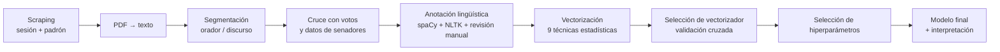
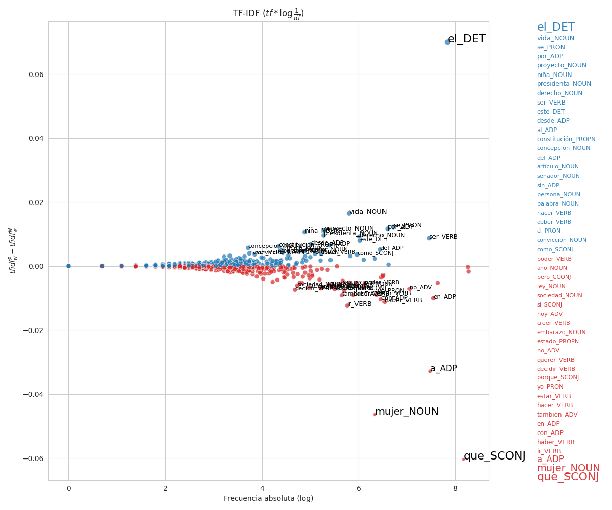
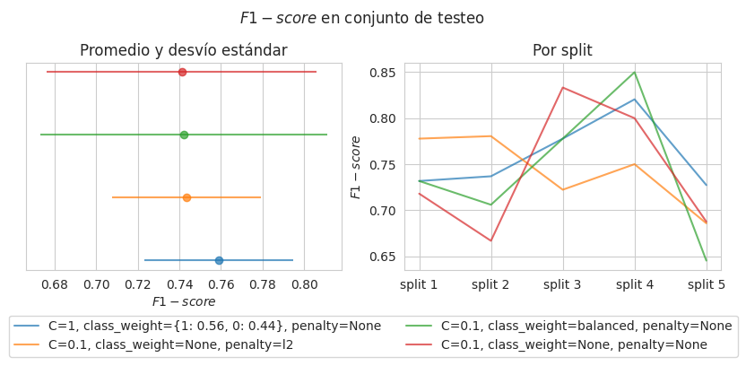
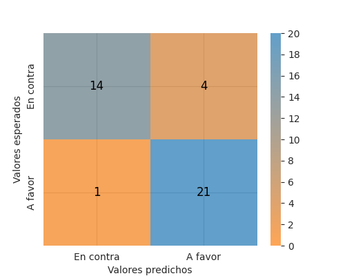
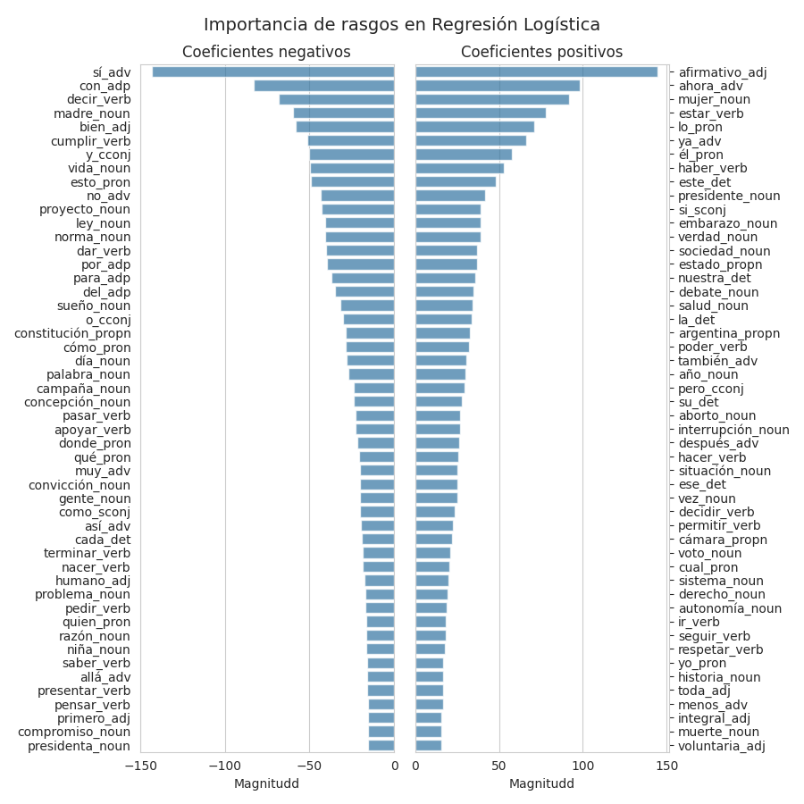

# Vectorización de discursos políticos sobre el aborto

[](https://macfernandez.github.io/eddc-specialization-project/final-project.pdf)
[](https://github.com/macfernandez/eddc-specialization-project/actions/workflows/build-project.yml)


> Trabajo final de la [Especialización en Explotación de Datos y Descubrimiento del Conocimiento](https://datamining.dc.uba.ar/datamining/) (FCEN, Universidad de Buenos Aires).
>
> **Título:** _Selección de técnicas estadísticas para la vectorización de discursos políticos referidos a la reglamentación del acceso al aborto._
>
> 🇬🇧 **English TL;DR:** End-to-end NLP project (in Python) over the December 2020 Argentine Senate session that legalized abortion. It applies the methods from Monroe et al.'s _["Fightin' Words"](https://doi.org/10.1093/pan/mpn018)_ to compare several text-vectorization techniques, and trains a logistic regression that classifies each speech by vote with ~78% accuracy. The pipeline covers web scraping, PDF-to-text extraction, linguistic annotation (POS tagging and lemmatization, reviewed by hand), vectorizer comparison via cross-validation, and model interpretation. **The repository and the final project are written in Spanish.**

---

## ¿De qué se trata?

El 29 y 30 de diciembre de 2020, el Senado argentino debatió y aprobó la Ley 27.610 de **Interrupción Voluntaria del Embarazo**. Toda esa sesión quedó registrada en una transcripción taquigráfica pública.

Este trabajo parte de una pregunta concreta:

> **¿Se puede predecir el voto de un senador o senadora a partir de las palabras que usó en el recinto?**

Para responderla, construí —de punta a punta y en Python— el recorrido completo de un proyecto de PLN: desde el _scraping_ de los datos crudos del Estado hasta el entrenamiento e interpretación de un modelo de clasificación, pasando por un proceso de anotación lingüística manual. El foco metodológico está en **comparar distintas técnicas estadísticas de vectorización** de texto (basadas en el trabajo de [Monroe et al., 2008, _"Fightin' Words"_](https://doi.org/10.1093/pan/mpn018)) para ver cuál representa mejor un discurso político.

## Los datos

| Fuente | Contenido |
| --- | --- |
| Transcripción taquigráfica de la sesión | Discursos de cada orador (scrapeada del [sitio del Senado](https://www.senado.gob.ar/parlamentario/sesiones/)) |
| Padrón de senadores | Provincia, partido y bloque de cada banca |
| Votos | Voto emitido por cada senador (anotado manualmente) |

- **70 senadores**, **24 provincias**, ~25 partidos agrupados en tres familias políticas.
- Tras la anotación: **8324 anotaciones revisadas** y **4889 _tokens_ únicos** (lema + categoría gramatical).
- Conjunto final de discursos: **56% a favor / 44% en contra**.

## El recorrido



Cada paso está documentado en las [notebooks numeradas](./notebooks/) y desarrollado en detalle en el [trabajo final](https://macfernandez.github.io/eddc-specialization-project/final-project.pdf).

## Resultados principales

**1. ¿Qué palabras distinguen un voto del otro?** Se contrastaron nueve técnicas de vectorización (diferencia de frecuencias y proporciones, _odds ratio_, _log-odds_, TF-IDF, _word scores_). La de **TF-IDF con logaritmo de la frecuencia inversa de documentos** fue la que mejor equilibró precisión y cobertura.



**2. ¿Qué vectorizador entrena el mejor modelo?** Cada vectorizador se usó para entrenar una regresión logística _baseline_ y su rendimiento (F1) se comparó mediante validación cruzada. El de TF-IDF (log IDF) volvió a destacarse: obtuvo el F1 más alto y más estable a lo largo de las cinco iteraciones.



**3. El modelo final** —regresión logística + TF-IDF (log IDF)— se evaluó sobre un conjunto de test separado de 40 discursos, donde alcanzó un 78% de _accuracy_. La tabla resume su rendimiento por clase:

| Clase | Precisión | Cobertura | F1 |
| --- | --- | --- | --- |
| En contra | 0.93 | 0.78 | 0.85 |
| A favor | 0.84 | 0.95 | 0.89 |
| **Accuracy** | | | **0.78** |



**4. ¿Qué pesa en cada predicción?** Las palabras con mayor peso en el modelo dibujan con nitidez los dos marcos del debate: la decisión, el cuerpo y la salud de la mujer del lado del _a favor_; la concepción, la vida y el marco normativo del lado del _en contra_.



> 📄 **El desarrollo completo —metodología, decisiones de anotación y discusión— está en el [trabajo final en PDF](https://macfernandez.github.io/eddc-specialization-project/final-project.pdf).**

## Estructura del repositorio

```
├── src/                  # pipeline de obtención y preprocesamiento de datos
│   ├── __main__.py       # punto de entrada (ver "Descarga de los datos")
│   ├── downloaders/      # scraping de la sesión y del padrón de senadores
│   └── preprocessor/     # conversión PDF→texto y segmentación de discursos
├── notebooks/            # flujo de trabajo paso a paso (01 … 06)
├── doc/                  # trabajo final en LaTeX, secciones, gráficos y bibliografía
├── data/                 # datos versionados (votos, mapeos, etc.)
├── bibliography/         # material de referencia
└── config.json           # URLs y rutas de salida para la descarga
```

El detalle de cada notebook está en [`notebooks/README.md`](./notebooks/README.md).

## Reproducir el proyecto

### Opción A — Entorno local

Crear un entorno con Python 3.11.4 (por ejemplo con [`pyenv`](https://github.com/pyenv/pyenv) + [`virtualenv`](https://pypi.org/project/virtualenv/)) e instalar las dependencias:

```bash
pyenv virtualenv 3.11.4 eddc && pyenv activate eddc
pip install --upgrade pip && pip install -r requirements.txt
```

### Opción B — Contenedor (Dev Container)

El repo incluye un [`devcontainer`](./.devcontainer/devcontainer.json) que reproduce todo el entorno. En VSCode: `Ctrl+Shift+P` → **Dev Containers: Reopen in Container**.

### Descarga de los datos

El repo ya trae el archivo `data/session_29-12-2020_votes.csv` con los votos. Para descargar y preprocesar el resto de los datos de la sesión:

```bash
python -m src download data
```

Este comando descarga la transcripción de la sesión n.º 28 (período 138) en PDF, la convierte a texto plano, separa los fragmentos discursivos por orador (`session_29-12-2020_discourse.xml`), extrae la lista de asistentes y descarga el padrón de senadores con su partido y provincia.

### Compilar el trabajo final

El PDF se compila automáticamente en CI, pero también podés generarlo localmente:

```bash
cd doc && latexmk -pdf -shell-escape main.tex
```

## Autora

**Macarena Fernández Urquiza** — 2024.

Si te interesa el procesamiento de lenguaje natural en español o el análisis de discurso político, ¡los comentarios e _issues_ son bienvenidos!
